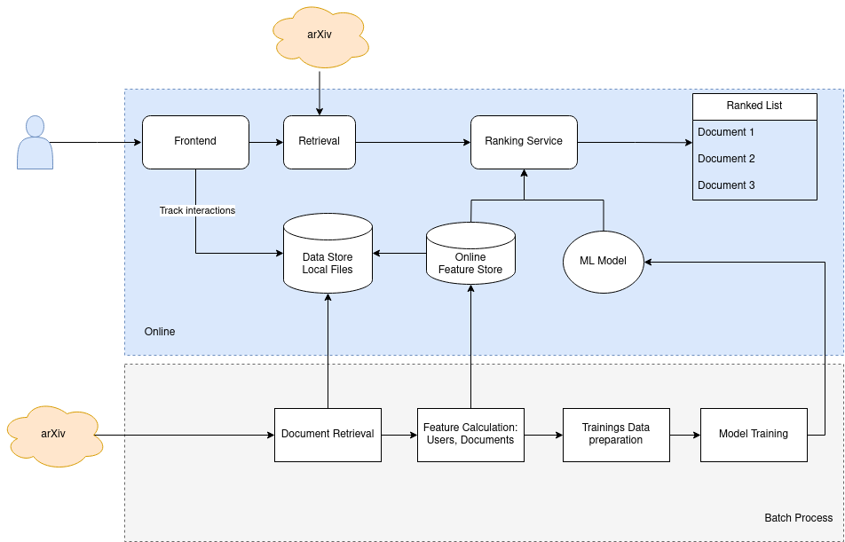

# Article Recommender System

This repo contains a system design study for a recommender system of arXiv articles. 
The idea is to explore the components for a complete system in combination, not to create a production-ready system
or a polished recommender model.

See the great book 'Machine Learning System Desing Interview' by Ali Aminian and Alex Xu 
for more examples and better descriptions.  

## High Level Design

## Setup 
- Install requirements in your favourite environment
- Prepare documents to recommend by running 'make run_preprocessing'
- Start the services in a docker by running 'make run'
  - Or alternatively locally with 'make run_frontend' and 'make run_ranking'
- Find the frontend at http://0.0.0.0:8501/ and the backend api at  http://0.0.0.0:8000

## Components
- Frontend by Streamlit
- Backend Service as FastAPI
- Docker Compose to run Services
- Batch Process simple Python
- Feature Store Feast
- Data stored as local files

Thank you to arXiv for use of its open access interoperability.
