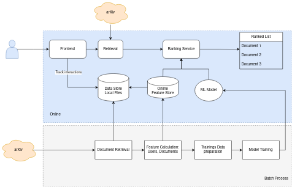

# Article Recommender System

A system design study for a recommender system of arXiv articles. 
The idea is to explore the components for a complete system in combination, not to create a production-ready system
or a polished recommender model.

## High Level Design

## Setup 
- Install requirements in your favourite environment
- Prepare documents to recommend by running 'make run_preprocessing'
- Start the services in a docker by running 'make run'
  - Or alternatively locally with 'make run_frontend' and 'make run_ranking'
- Find the frontend at http://0.0.0.0:8501/ and the backend api at  http://0.0.0.0:8000

## Components
- Docker Compose: run containerized services
- Frontend: UI (Streamlit)
- Backend Service: Ranking (FastAPI)
- Preprocessing: Batch processes, model training (Python scripts)
- Data storage (simply as local files)
- Feature store (Feast)

### Frontend

A simple UI build with streamlit. A user can  
- get recommendations 
- search the arXiv with a custom search term.

To improve future recommendations
- clicks on results and clickouts to the article on the arxiv are tracked.

Users are required to enter their id manually
(user management is left out for simplicity).

### Backand API for recommendations

Built with FastAPI, this service
- reranks search results from the arXiv api (not personalized) based on semantic similarity
of embeddings
- provides personalized recommendations for a user.

In particular
- eatures and candidate documents are loaded,
- a scoring model is served,
- for which some features are retrieved from the online feature store and others calculated on the fly.

### Preprocessing: data for serving and training
Batch process to

- fetch article metadata from the arXiv as document recommendations,
- parse user logs to aggregate user and user-document interaction features,
- store results to be used in the feature store for serving and as historical features for model training.

It should be scheduled daily to update the recommendation results as well as the features used by the 
recommender model.

### Scoring Model

Script to retrain the scoring model and a class to load it in the backend for serving.
The model should score a set of candidate documents for a user based on document features, user features
and user-document features.

For a new model
- Prepare features from the logs and the documents. 
- Run the training script
This step could also be containerized and scheduled (with a cron job or another workflow tool).

The model here is a very simple content-based model. Since there is no user data here, it doesn't 
really make sense to implement a more complex one, but if it were to be extended, one could go
for a multi-task model to predict click-outs and detail views. 
It mostly has to recommend new articles, so a purely collaborative filtering approach might not work well. 

### Feature Store

See [Feast](https://feast.dev/) ( **Fea**ture **St**ore)

- Just for fun.
- Data for the feature store is prepared in the preprocessing workflow.
- The Feature Store is initiated in the backend API to provide user features for the recommendation model.

The feature store's capabilities are not really exploited here, it could be used to  
- store document features for inference as well.
- provide historical features in training.
- Feature updates might be pushed to the online store after each user action.

## References
- This setup is based on an idea from the great 'Machine Learning System Design Interview' book by Ali Aminian and Alex Xu, 
which contains many excellent descriptions of machine learning systems.
-  Thank you to [arXiv](https://arxiv.org/) for use of its open access interoperability.
